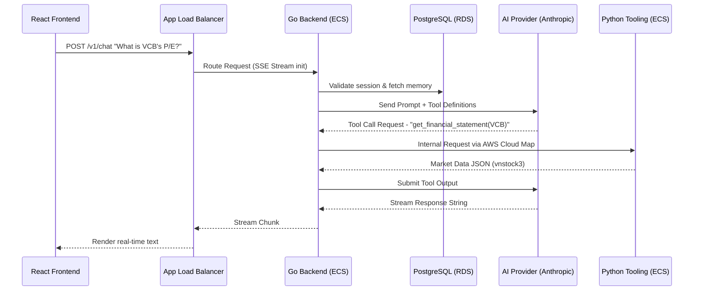

# StockMind AWS Deployment & Architecture Design
**Date:** 2026-03-19

## 1. Overview
The goal is to deploy the StockMind application to AWS using a production-ready, scalable architecture. The chosen approach is a **Fully Containerized AWS Fargate Architecture**. Everything—including the React frontend, Go backend, and Python data tooling—runs as Serverless containers on ECS, orchestrated securely behind a single Application Load Balancer (ALB).

## 2. Architecture & Components

*   **Frontend Service (Nginx)**: The React/Vite application is compiled into static files and bundled into an Nginx Docker container. This container is deployed on Amazon ECS (Fargate).
*   **Backend Compute**: 
    *   **Go Backend Service**: Deployed as an Amazon ECS Linux container using AWS Fargate.
    *   **Python Tooling Service**: Deployed as a separate Amazon ECS container.
*   **Database Layer**: Protected Amazon RDS instance for PostgreSQL.
*   **Networking**:
    *   A single public-facing **Application Load Balancer (ALB)** receives all internet traffic.
    *   Path-based routing on the ALB sends requests for `/v1/*` to the Go Backend containers, and all other requests (`/*`) to the Nginx Frontend containers.
    *   ECS containers for all services and the RDS instance reside in Private Subnets.
    *   The Go backend and Python tooling communicate via internal DNS (AWS Cloud Map / Service Connect).

## 3. Data Flow

1.  User accesses the site; the ALB receives the request (`/*`) and routes it to the Nginx Frontend container in ECS, which serves the compiled React UI.
2.  User actions (e.g., sending a chat message to the Assistant) trigger API requests routed through the internet to the ALB.
3.  ALB detects the `/v1/*` path and forwards the request to the Go Backend container.
4.  The Go Backend validates the session against PostgreSQL (RDS) and sends the query to the chosen LLM (Anthropic/OpenAI).
5.  If financial data is needed, Go requests it internally from the Python Tooling Service, which fetches data from `vnstock3` and replies.
6.  The final Agent response streams back via Server-Sent Events (SSE) to the UI.

## 4. Sequence Diagram (Conversational AI Flow)

## 5. Reliability & Error Handling
*   **Auto-Scaling & Self-Healing**: AWS Fargate automatically provisions compute power. If any container crashes (Frontend, Backend, or Python), ECS restarts it and the ALB seamlessly routes traffic to healthy instances without downtime.
*   **Third-party Timeouts**: Backend is configured to sensibly catch API timeouts (LLM or VNStock) and stream a fallback error response to the client instead of dropping the SSE connection or crashing the backend.
