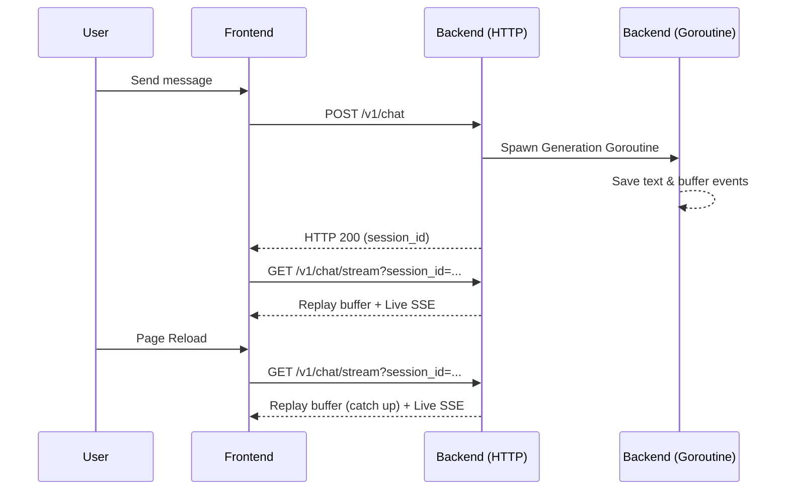

# Design Spec: Uninterrupted Streaming on Reload

## Goal
To provide a seamless user experience during LLM generation by allowing the frontend stream to continue without interruption even if the user reloads the web page.

## Architecture

We are using an **In-Memory Event Hub with Replay Buffer**.
This shifts the state of the active streaming session from the transient HTTP connection to a persistent goroutine and a thread-safe Memory Buffer on the Go Backend. 

### Backend Changes

1.  **StreamManager (In-Memory Hub):**
    *   Create `internal/server/stream.go`.
    *   Initialize `StreamManager` struct with a `sync.RWMutex` mapping `uuid.UUID` to a `SessionStream`.
    *   `SessionStream` contains:
        *   `events []agent.ChatEvent` (the buffer for the current turn).
        *   `subscribers []chan agent.ChatEvent` (active listeners).
        *   `mu sync.Mutex` for thread safety.
        *   `isComplete bool` to track the end of generation.

2.  **API Endpoints:**
    *   `POST /v1/chat`: 
        *   Parses the request (text, files), creates/gets the Session.
        *   Instead of holding the HTTP connection open, it spins up a goroutine executing `session.HumanInput()` and `session.ContinueTurn()`.
        *   Registers a `chatCallback` that appends events to the `SessionStream` buffer and broadcasts to all subscribers.
        *   Returns `HTTP 200 OK` with JSON `{"session_id": "<uuid>"}` immediately.
    *   `GET /v1/chat/stream?session_id=<uuid>`: 
        *   SSE endpoint.
        *   Looks up the `SessionStream`.
        *   If the stream is not complete, it first pushes all buffered `events` to the client.
        *   Then it registers a new subscriber channel and blocks, waiting for live events, forwarding them as SSE.
        *   Once `IsEnd` event is received, it deregisters and closes the connection.

### Frontend Changes

1.  **API Client (`api/chat.ts`):**
    *   Split the current logic.
    *   `startChatSession`: Submits the `POST /v1/chat` and returns the `sessionId`.
    *   `streamChatEvents`: Uses `fetch` with `TextDecoder` to connect to `GET /v1/chat/stream?session_id=<uuid>`, executing the `onMessage` callback dynamically.

2.  **UI Component (`Chatbot.tsx`):**
    *   When the user submits a prompt, call `startChatSession`. Once the `sessionId` is returned, update the URL and trigger `streamChatEvents`.
    *   **On Page Reload:**
        *   Check for `id` in the URL.
        *   Call `getMessages(id)` to load DB history.
        *   Simultaneously call `streamChatEvents(id)` to catch any ongoing stream in the background. The server's Replay Buffer will ensure smooth patching of the current response if generation was mid-way.
        *   If the generation was already finished, the SSE gracefully receives an array of zero unseen events and closes.

## Data Flow Diagram

## Review Requirements
- [x] Confirm no Redis dependency.
- [x] Confirm PostgreSQL is unburdened by token-by-token inserts.
- [x] Confirm Frontend UI handles buffered event playback gracefully without flickering.
